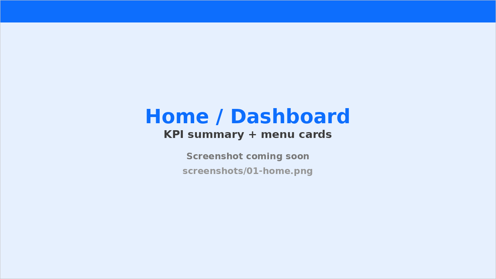
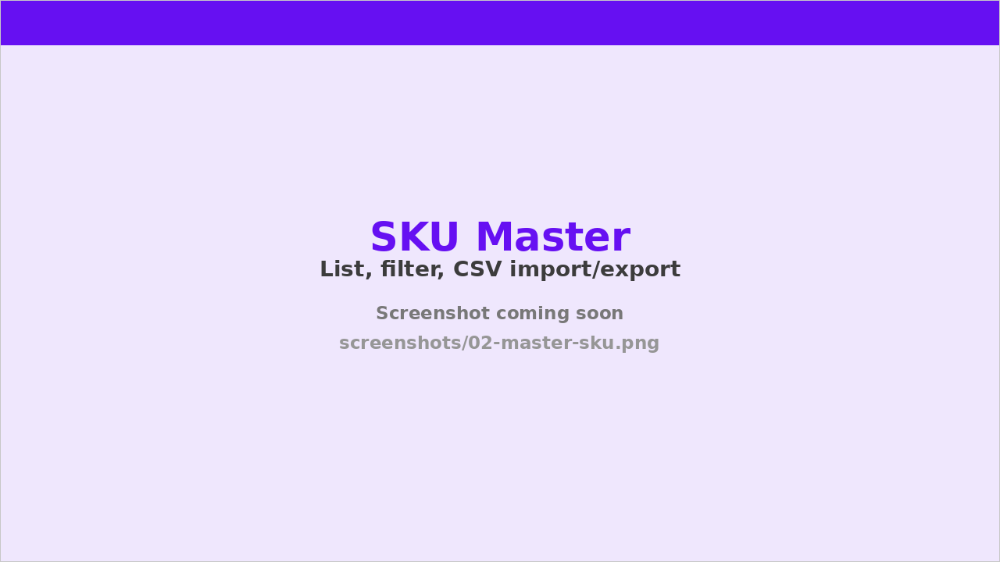
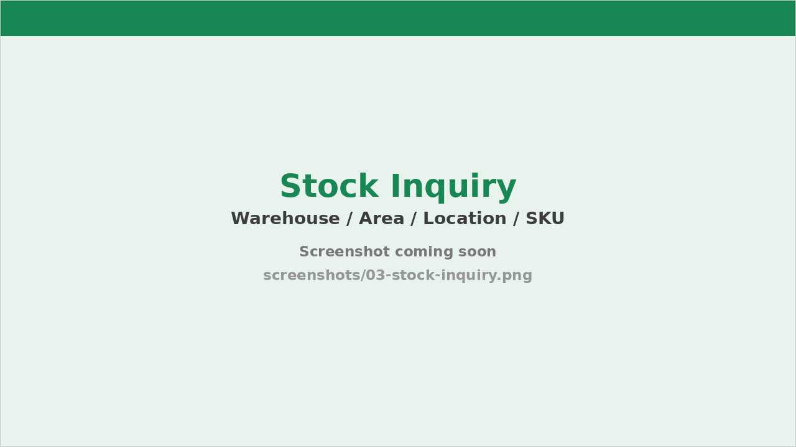
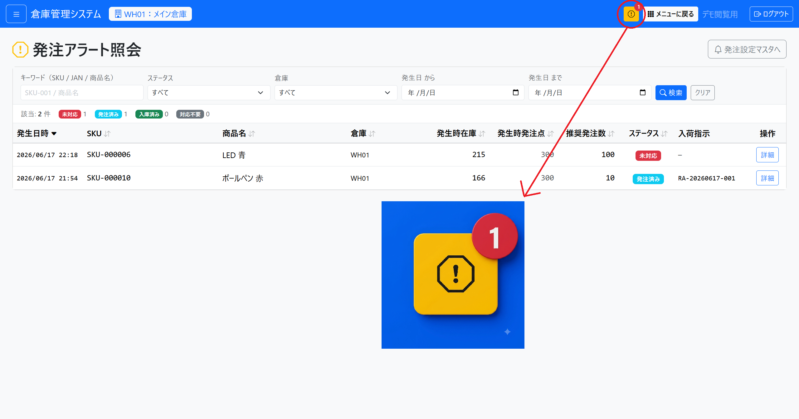
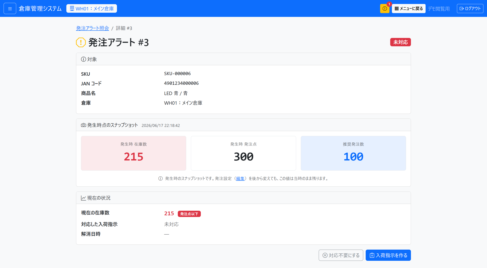
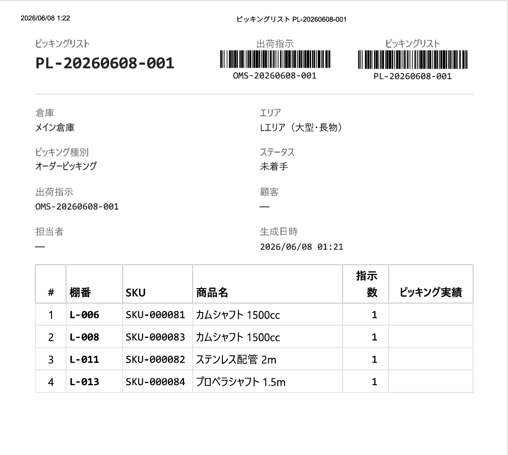

# WMS — 倉庫管理システム

実運用を想定して設計・実装した倉庫管理システム（Warehouse Management System）です。
マスタ管理から入出荷・在庫・棚卸・発注アラートまでの一連の業務を、PC とハンディ端末の両方で完結できます。

🌐 **本番サイト**: <https://komaki-wms.com>（AWS EC2 + RDS でホスティング）
📁 **リポジトリ**: 本リポジトリ
👤 **作者**: 個人開発 / 転職用ポートフォリオ



---

## 目次

- [このプロジェクトについて](#このプロジェクトについて)
- [主要機能](#主要機能)
- [スクリーンショット](#スクリーンショット)
- [技術スタック](#技術スタック)
- [設計のこだわり](#設計のこだわり)
- [アーキテクチャ](#アーキテクチャ)
- [プロジェクト構成](#プロジェクト構成)
- [EC サイト連携](#ec-サイト連携)
- [CI / デプロイ](#ci--デプロイ)

---

## このプロジェクトについて

ECや製造業の物流現場で使われる **WMS（倉庫管理システム）** を、ゼロから設計・実装した個人開発プロジェクトです。

業務系 Web アプリの一般的な要素（マスタ CRUD・帳票・CSV 入出力・権限管理・履歴管理）に加えて、現場のハンディ端末を想定した **スマホ最適化画面 + カメラによるバーコードスキャン** までを含めています。

### 規模感（2026-05 現在）

| 指標 | 値 |
| --- | --- |
| アプリ数（Django app） | 6（masters / stock / inbound / outbound / accounts / core） |
| モデル数 | 31 クラス（テーブル設計上は 41 テーブル） |
| ビュークラス数 | 116 |
| HTML テンプレート数 | 83 |
| Python コード行数（migrations 除く） | 約 13,700 行 |
| マイグレーション数 | 累計 25 |

---

## 主要機能

### マスタ管理
- 倉庫 / エリア / ロケーション / カテゴリ / メーカー / 商品 / SKU / 顧客 / 仕入先 の **8 マスタ**
- 一覧 / 検索 / 作成 / 編集 / 削除（CRUD）+ **CSV インポート / エクスポート**（区切り文字 `,` / `^` 選択可）
- FK は **PROTECT 中心**：参照されているマスタは削除させない（誤削除防止）

### 在庫管理
- **在庫照会**：倉庫・エリア・ロケーション・SKU で絞り込み、CSV エクスポート可
- **入出庫履歴**：StockMovement を時系列で表示、参照元（入荷指示 / 出荷指示 / 棚卸調整 / 手動）まで追跡
- **棚移動**：棚→棚の在庫移動を 1 トランザクションで処理
- **棚卸**：全数棚卸 / 循環棚卸の両方をサポート（全数中の在庫変動はロックでブロック）

### 入荷管理
- 入荷指示の作成（手動 / ASN / 返品）→ 検品 → 格納 → 完了
- 入荷予定リストを **A4 印刷**（Code128 バーコード入り）

### 出荷管理
- 出荷指示の作成（手動 / OMS / 返品）→ 引き当て → ピッキング → 検品 → 出荷
- ピッキングリスト・送り状の印刷
- 引き当てロジックは別ドキュメントで設計（FIFO ベース）

### 発注設定 + 発注アラート
- SKU ごとに発注点 / 発注量を設定
- 在庫の更新（`StockBalance.post_save`）をフックして **自動でアラート生成**
- アラート → 入荷指示への 1 クリック変換、入荷完了で自動 resolved

### ハンディ作業者ロール
- 専用グループのユーザーは **ハンディ画面しか開けない**（`HandheldOnlyMiddleware`）
- 入荷検品 / 入荷格納 / 棚卸カウント / 出荷ピッキング をスマホで完結
- **カメラスキャン**（BarcodeDetector API + Canvas 切り出しによる枠内検出）
- **振動フィードバック**（Android のみ・処理結果を体感で通知）

### 印刷帳票
- すべて **A4 印刷を前提に CSS で組版**（外部 PDF ライブラリ不使用）
- **Code128 バーコードを自前実装**（印刷側と読取側を密結合で安定動作させるため）

### エラーログ
- 取込エラー（OMS / CSV）と例外発生（500 系）を一元管理
- 対応済み / 未対応のステータス管理

---

## スクリーンショット

> 画面はすべて Bootstrap 5 ベース。PC（業務）とスマホ（ハンディ）でレイアウトと操作系を分けています。

### ホーム / 業務ハブ
KPI サマリーと機能カテゴリ別のカードグリッド。


### マスタ照会（SKU）
共通の照会画面パターン（フィルタ + 並び替え + CSV インポート / エクスポート + ページネーション）。



### 在庫照会
倉庫・エリア・ロケーション・SKU を AND で絞り込み。CSV 出力もそのまま絞り込み条件を反映。



### ハンディ画面（出荷ピッキング）
スマホ画面に合わせた縦長レイアウト。カメラでバーコード読取 → 数量入力 → 次の棚へ進む。


### 発注アラート照会（一覧）
在庫が発注点を割ったら自動生成し、画面上部に通知アイコンが点灯して未対応件数を表示。ステータス（未対応 / 発注済み / 入庫済み / 対応不要）と倉庫で絞り込み可。



### 発注アラート（詳細）
発生時のスナップショット（在庫数・発注点・推奨発注数）を保持し、その後に発注設定を変更しても発生当時の値が残る。「入荷指示を作る」ボタンで 1 クリック変換、入荷完了で自動 resolved。



### 印刷帳票（ピッキングリスト）
ブラウザ印刷でそのまま A4 出力。Code128 バーコードはサーバ側 SVG 生成。



---

## 技術スタック

### バックエンド
- **Python 3.12**
- **Django 5.2**（MTV / Class-Based Views 中心）
- **PostgreSQL 17**
- **gunicorn**（WSGI / `--preload --timeout 60`）
- **whitenoise**（静的ファイル配信）

### フロントエンド
- **Bootstrap 5**（テーマカスタマイズなし）
- **素の JavaScript**（フレームワーク不使用 / `static/wms.js` に共通化）
- **BarcodeDetector API**（カメラスキャン・Chromium 系のみ）
- **PWA**（manifest + apple-touch-icon、スマホのホーム画面追加対応）

### 開発 / インフラ
- **uv**（依存管理 / `uv.lock` で再現性確保）
- **ruff**（lint + format）
- **Docker Compose**（開発用 PostgreSQL のみ）
- **GitHub Actions**（CI：ruff + Django check + makemigrations --check）
- **AWS EC2** (Ubuntu 24.04) **+ RDS** (PostgreSQL) + **nginx** + **Let's Encrypt**（本番）

---

## 設計のこだわり

### 1. FK PROTECT を基本にした「壊れないマスタ」
削除の連鎖を起こさず、参照されているマスタは削除できないようにしています（`on_delete=PROTECT`）。
削除しようとすると、依存している件数を画面に表示して止めます。これは実運用で **「誤って親マスタを消す」事故** を防ぐためです。

### 2. ハンディ専用ロールの徹底
`HandheldOnlyMiddleware` で、ハンディ作業者グループのユーザーは指定されたプレフィックスの URL しか開けないようにしています。
AJAX API もこの ALLOWED_PREFIXES に登録する必要があり、追加時の取りこぼし防止のため **demo ユーザー（worker1）での実機確認** をワークフロー化しています。

### 3. 在庫の二重表現（StockBalance / StockMovement）
- `StockBalance`：現在在庫を `(location, sku)` ユニーク制約で 1 行ずつ保持
- `StockMovement`：すべての増減を時系列で追記（before / after / 参照元タイプ / 参照元 ID）

これによって「現在いくつあるか」と「いつ・なぜ増減したか」を両立しています。発注アラートは `StockBalance.post_save` シグナルで発火（`StockMovement.post_save` だと早すぎて誤動作することが分かったため）。

### 4. 業務画面の UX 規約を全画面で統一
- Enter / ↑ / ↓ で次のフィールドへ移動（業務端末ライクなキーボード操作）
- 送信ボタンに `data-confirm` 属性を付けて確認モーダルを自動表示
- マスタ一覧は `align-middle` + `font-monospace` でコード列を等幅
- 「PC 画面は最大 1200px の narrow レイアウト」など、画面共通の組版規約を社内ドキュメントに明文化

### 5. CSV 入出力は自前実装
Django ライブラリに頼らず、区切り文字（`,` / `^`）と文字コードを画面から選べるようにしています。
8 マスタ + 入荷指示 + 出荷指示に対応。エラー時は行番号付きで返します。

### 6. 印刷帳票も自前実装
外部 PDF ライブラリ不使用。CSS の `@media print` と `@page` だけで A4 帳票を組み、Code128 バーコードは SVG を Python 側で生成しています（読取側のカメラ検出器と同じ仕様にすることで安定動作）。

### 7. テストデータ生成コマンド
`reset_and_seed` 1 コマンドで、ユーザー以外を削除して中規模データ（SKU 100 / ロケーション 192 / 在庫 約 500 / 入出庫履歴 約 600）を投入できます。乱数シード指定可。

---

## アーキテクチャ

```
┌───────────────┐
│  ブラウザ      │
│ (PC / スマホ)  │
└───────┬───────┘
        │ HTTPS
        ▼
┌───────────────┐
│  nginx         │ ← Let's Encrypt（証明書）
│ (静的配信)     │
└───────┬───────┘
        │ proxy_pass
        ▼
┌───────────────┐
│  gunicorn      │ ← systemd で常駐
│ (WSGI)         │
└───────┬───────┘
        │ Django (MTV)
        ▼
┌───────────────┐
│ PostgreSQL     │
│   (RDS)        │
└───────────────┘
```

主要な処理フロー：

| 業務 | 主なテーブル |
| --- | --- |
| 入荷 | `InboundOrder → InboundOrderItem → InboundReceipt → StockMovement → StockBalance` |
| 出荷 | `OutboundOrder → OutboundOrderItem → StockReservation → PickingList → Shipment → StockMovement → StockBalance` |
| 棚卸 | `StocktakeSession → StocktakeItem → StocktakeAdjustment → StockMovement → StockBalance` |
| 発注アラート | `StockBalance.post_save → SkuReorderSetting と照合 → ReorderAlert 生成` |

---

## プロジェクト構成

```
wms/
├── accounts/           # カスタム User / ハンディ作業者ロール / 権限ミドルウェア
├── masters/            # 8 マスタ（倉庫・エリア・棚・カテゴリ・メーカー・商品・SKU・顧客・仕入先）
├── stock/              # 在庫・履歴・棚移動・棚卸・発注設定・発注アラート
├── inbound/            # 入荷指示・検品・格納
├── outbound/           # 出荷指示・引当・ピッキング・検品・出荷
├── core/               # ホーム画面 / エラーログ / 共通ミックスイン / テストデータ生成コマンド
├── config/             # Django プロジェクト設定（settings.py / urls.py）
├── templates/          # 共通テンプレート（a/base.html など）+ ハンディ用テンプレート
├── static/             # CSS / wms.js（共通 JS）/ ロゴ / favicon / manifest
├── deploy/             # gunicorn.service / nginx.conf（本番デプロイ用）
├── sample_csv/         # マスタ CSV のサンプル
├── screenshots/        # README で参照しているスクリーンショット
├── docker-compose.yml  # 開発用 PostgreSQL
├── pyproject.toml      # 依存定義（uv）
├── uv.lock
└── README.md
```

---

## CI / デプロイ

### CI（GitHub Actions）
`master` への push と PR で自動実行：

1. `ruff check`（lint）
2. `ruff format --check`（フォーマット）
3. `python manage.py check`（Django 設定 / モデル / URL 整合性）
4. `python manage.py makemigrations --check`（マイグレーション漏れ検出）

### 本番デプロイ
要点：

- **EC2**（Ubuntu 24.04 / t3.small）+ **RDS**（PostgreSQL t3.micro / 単一AZ）
- **nginx**（HTTPS 終端 + 静的配信）→ **gunicorn**（systemd 常駐）→ **Django**
- **Let's Encrypt**（certbot）で HTTPS 化
- **PWA**（manifest + apple-touch-icon）でスマホのホーム画面追加に対応

CD は組まず、コード反映は SSH での `git pull` → `migrate` → `collectstatic` → `systemctl restart gunicorn` を手動で行う運用です（個人ポートフォリオなのでオーバースペックを避けた判断）。

---

## EC サイト連携

WMS と連携する **EC サイト** を別リポジトリで実装・本番稼働中。業務系（PC + ハンディ）の WMS に対して、顧客向け SPA を **マイクロサービス的に分離** して構築し、複数システム連携の事例とした。

🌐 **本番サイト**: <https://ec.komaki-wms.com>（WMS と同じ EC2 に相乗りデプロイ、追加コストほぼ 0）

### 構成（案 Y: マイクロサービス的）

```
┌────────────────┐       ┌────────────────────┐       ┌──────────────────┐
│ EC Frontend    │       │ EC Backend         │       │ WMS              │
│ React 19 +     │       │ Django + DRF       │       │ Django + DRF     │
│ TypeScript     │ ◀──▶ │ - 商品プロキシ      │ ◀──▶ │ - 商品マスタ      │
│ + Vite         │       │ - 価格マスタ        │       │ - 在庫           │
│ + Tailwind 4   │       │ - カート / 注文     │       │ - 入出庫         │
└────────────────┘       └────────────────────┘       └──────────────────┘
                              ↓                              ↓
                          EC DB                          WMS DB
                          (PostgreSQL "ec")              (PostgreSQL "wms")
```

### EC 側の実装規模

| 項目 | 値 |
| --- | --- |
| Backend アプリ | 3（`catalog` / `customers` / `orders`） |
| EC モデル | 9 クラス（EcCategory / EcProduct / EcSku / EcPrice / CustomerProfile / Cart / CartItem / Order / OrderItem） |
| Frontend ページ | 8（商品一覧 / 詳細 / カート / チェックアウト / ログイン / 注文履歴 / 注文詳細 / プロフィール） |
| Frontend コンポーネント | 13（Header / BottomNav / CategoryChips / ProductCard / ProductGrid / Pagination / Toast 他） |
| デザイン | Tailwind CSS 4、PC + スマホ両対応（ボトムナビ・カテゴリチップ） |

### 主要な設計判断と実装結果

| 項目 | 採用方針 |
| --- | --- |
| EC リポジトリ構成 | monorepo（`backend/` + `frontend/`） |
| DB 分離 | 同 RDS 内に `ec` データベースを新規作成、論理分離 |
| マスタ管理 | B パターン（EC 側に商品マスタのコピー、Django Management Command で同期） |
| 在庫表示 | 段階 1（都度 API、Redis 未採用、`get_stock()` 関数抽象化で将来差替え可能） |
| 価格カラム | EC 側 DB に保持（WMS には追加しない、既存設計の責務分離を維持） |
| 認証 | サービス間は API キー（Bearer）、顧客は Session ベース |
| Customer マスタ | EC 顧客は `CustomerProfile` で EC 側のみ管理（WMS には同期せず、個人情報リスク回避） |
| 商品画像 | EC 側 `media/` に保持、本番は同 EC2 上で nginx 配信 |
| インフラ | WMS と同じ EC2 に相乗り（gunicorn:8001 / nginx で `ec.komaki-wms.com` 配信） |

### API 仕様

本番 WMS API の OpenAPI スキーマは drf-spectacular で自動生成し、Swagger UI で公開している:

- **WMS API 仕様（動く版）**: <https://komaki-wms.com/api/schema/swagger-ui/>
- **EC API 仕様（動く版）**: <https://ec.komaki-wms.com/api/schema/swagger-ui/>

### 自動化される連携の例

顧客が EC でチェックアウトすると EC backend が WMS の `POST /api/orders/` を呼び、WMS 側で `OutboundOrder` が自動作成される。`_try_launch_order()` が在庫引き当て・ピッキングリスト生成までを連動実行し、倉庫作業者のハンディ画面に新規ピッキング待ちが即座に現れる。EC からの 1 アクションで業務フロー全体が起動する設計。
